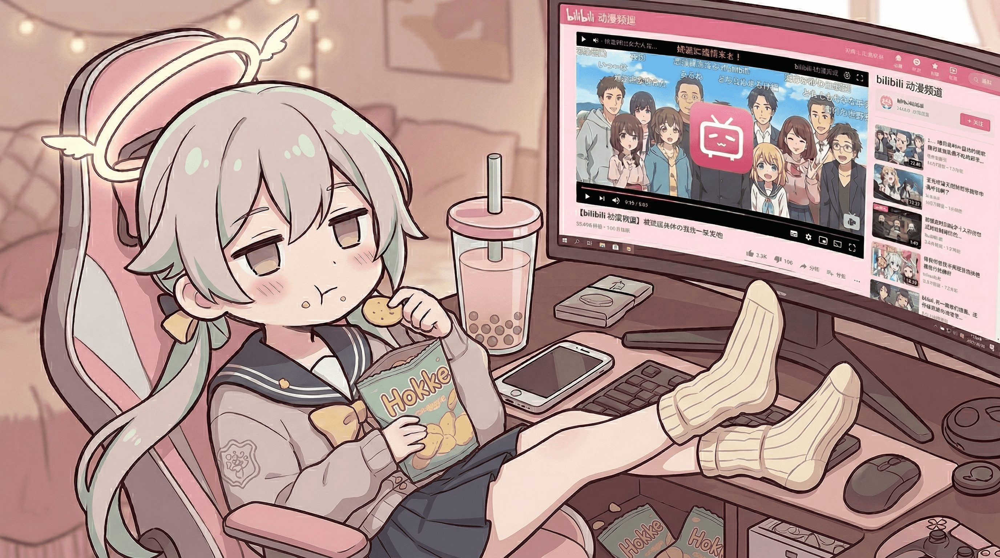
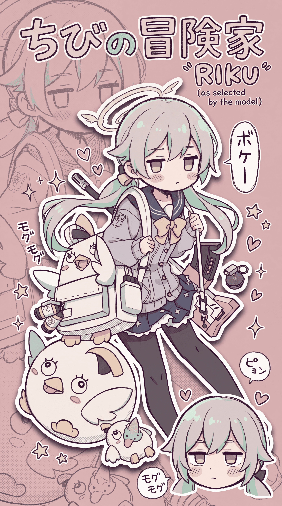

  
  

    
    
    
  

<table width="100%">
  <tr>
    <td width="62%" valign="top">
      <h3>About Me</h3>
      
这里是 <strong>Saneko</strong>， 一个非常非常 i 的人，喜欢宅在家里。网上话会多一点，现实里通常不太说话，偶尔会突然发一下神经。

      
平时喜欢刷视频，游戏偶尔玩 <code>Minecraft</code>，对生电比较感兴趣，建筑基本一窍不通。睡觉和零食哪个更重要？

      <h3>Stack</h3>
      

        
      

      <h3>Tools I Like</h3>
      

        
      

      
    </td>
    <td width="38%" valign="top" align="center">
      
    </td>
  </tr>
</table>

  stay happy | enjoy every little day

